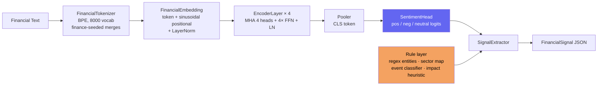

# nano-finbert


[](https://huggingface.co/spaces/9mark9/nano-finbert-demo)

> **🤗 Try it live:** [Financial Sentiment demo on Hugging Face Spaces](https://huggingface.co/spaces/9mark9/nano-finbert-demo) — powered by the production [finbert-minilm-sentiment](https://huggingface.co/9mark9/finbert-minilm-sentiment) model (95.29% held-out accuracy).

**The simplest, most readable financial NLP model you can actually understand.**

nano-finbert is a tiny transformer encoder (≈2M parameters) trained **from scratch** on financial text — no pretrained weights, no HuggingFace dependency, no black boxes. Inspired by Andrej Karpathy's [nanoGPT](https://github.com/karpathy/nanoGPT), every component is annotated to explain *why* it exists.

Feed it a financial headline. Get back a structured market signal.

```python
from finbert.signals import SignalExtractor

extractor = SignalExtractor()
signal = extractor.extract(
    "SpaceX's long-anticipated IPO filing sent aerospace stocks soaring to record highs"
)
print(signal.to_dict())
```

```json
{
  "text": "SpaceX's long-anticipated IPO filing sent aerospace stocks soaring to record highs",
  "sentiment": "positive",
  "confidence": 0.82,
  "entities": ["SpaceX", "aerospace"],
  "sectors": ["aerospace", "equities"],
  "event_type": "ipo",
  "impact_score": 0.71,
  "signal_direction": "bullish"
}
```

> **🚀 Two variants — pick what you need:**
>
> | | This repo (`nano-finbert`) | Production model |
> |---|---|---|
> | Goal | *Learn* the internals | *Use* it for real accuracy |
> | Build | From scratch, ~2M params, annotated | MiniLM (33M) fine-tuned |
> | Accuracy | Educational (~65–75% on tiny sample) | **95.29% held-out test** (macro-F1 0.937) |
> | Where | Here, on GitHub | **[🤗 9mark9/finbert-minilm-sentiment](https://huggingface.co/9mark9/finbert-minilm-sentiment)** |
>
> The production model is fine-tuned on [Financial PhraseBank](https://huggingface.co/datasets/takala/financial_phrasebank) and benchmarked on a fully held-out test split. The **95.29% / macro-F1 0.937** figures are the numbers reported on that model's own Hugging Face card, not a benchmark run in *this* repo — this repo trains the educational 2M-param model from scratch and does not ship a held-out eval harness or saved weights. Treat the from-scratch model's accuracy as illustrative (~65–75% on the tiny bundled sample), and use the linked production model when you need real accuracy.

---

## Architecture



The blue path (`SentimentHead`) is the **learned** transformer output. The orange
`Rule layer` (`signals.py`) is **deterministic** — regex entity tagging, a sector
keyword map, an event-type classifier, and a 0–1 impact heuristic. The
`SignalExtractor` fuses both into a single `FinancialSignal`. Keeping the
structured-signal logic rule-based (not learned) is deliberate: it stays
inspectable and needs no labelled data for entities/sectors/events.

## Model Architecture

| Component | Spec |
|-----------|------|
| Layers | 4 encoder layers |
| Hidden dim | 128 |
| Attention heads | 4 |
| Max sequence length | 256 tokens |
| Vocabulary size | 8,000 |
| Total parameters | ~2M |
| Training device | CPU (no GPU needed) |

**Tech stack:** PyTorch 2.x (model + training), a hand-written BPE tokenizer (no `tokenizers`/`transformers` dependency), FastAPI + Uvicorn (serving), pytest (404 test functions across the suite).

## How it works

Each stage maps to one module under `src/finbert/`, kept small and annotated so the
data flow is readable end-to-end:

1. **Tokenize** (`tokenizer.py`) — a from-scratch BPE tokenizer pre-seeded with a
   financial vocabulary (tickers, commodities, FX pairs, M&A/earnings terms) so domain
   tokens survive instead of being shattered into sub-words. Reserved ids: `[PAD]=0`,
   `[UNK]=1`. Target vocab 8,000.
2. **Embed** (`model.py → FinancialEmbedding`) — token embeddings (`padding_idx=0`) plus
   fixed sinusoidal positional encodings, followed by LayerNorm.
3. **Encode** (`model.py`) — 4 Transformer encoder blocks, each: multi-head self-attention
   (4 heads, scaled dot-product, no-bias Q/K/V projections) → residual + LN → position-wise
   FFN with 4× expansion → residual + LN.
4. **Pool + classify** (`model.py → SentimentHead`) — CLS-token pooling into a 3-way
   sentiment head (positive / negative / neutral logits). This is the only **learned**
   prediction in the structured signal.
5. **Extract signal** (`signals.py`) — a deterministic layer turns the sentiment plus the
   raw text into a `FinancialSignal`: regex entity tagging, a sector keyword map, an
   event-type classifier (ipo / earnings / rate_decision / merger / …), an impact heuristic
   (0–1), and a derived bullish/bearish/neutral direction.

Because steps 1–4 are written from scratch (no pretrained weights, no HuggingFace), the
goal is comprehension over accuracy — the production variant above is the one to deploy.

## Quick Start

### Install

```bash
pip install torch --index-url https://download.pytorch.org/whl/cpu
pip install fastapi uvicorn pydantic
git clone https://github.com/shaikn6/nano-finbert
cd nano-finbert
export PYTHONPATH=src
```

### Extract a signal

```python
from finbert.signals import SignalExtractor

extractor = SignalExtractor()  # uses random weights; load a checkpoint for real inference

# Single signal
signal = extractor.extract("Bitcoin dropped below $60,000 as SEC regulatory pressure mounted")
print(signal)
# FinancialSignal(sentiment='negative', direction='bearish', confidence=0.74, impact=0.52, ...)

# Batch extraction
texts = [
    "Gold futures fell 2.3% amid dollar strength and Fed rate hike concerns",
    "NVIDIA quarterly revenue hit $22 billion on AI accelerator demand",
    "ECB held interest rates steady, signaling a data-dependent approach",
]
signals = extractor.extract_batch(texts)
for s in signals:
    print(f"[{s.signal_direction:7s}] [{s.event_type:15s}] {s.text[:60]}")
```

### Serve the API

```bash
docker-compose up
# or:
uvicorn finbert.api.server:app --host 0.0.0.0 --port 8000 --reload
```

```bash
curl -X POST http://localhost:8000/extract \
  -H "Content-Type: application/json" \
  -d '{"text": "SpaceX IPO raised $10 billion at a $250 billion valuation"}'
```

### Train from scratch

```bash
python scripts/train.py --epochs 5 --batch-size 32 --output checkpoints/
```

## Supported Signal Types

| Field | Values |
|-------|--------|
| `sentiment` | `positive`, `negative`, `neutral` |
| `signal_direction` | `bullish`, `bearish`, `neutral` |
| `event_type` | `ipo`, `earnings`, `rate_decision`, `merger`, `commodity_move`, `regulatory`, `layoffs`, `product_launch`, `general` |
| `sectors` | `tech`, `aerospace`, `commodities`, `crypto`, `forex`, `equities`, `fixed_income` |

## Training

nano-finbert uses a tiny educational dataset (250+ curated financial phrases) included in `data/samples/financial_phrases.json`. The training loop in `src/finbert/train.py` is heavily annotated to explain every decision.

**Expected training behavior (5 epochs on sample data):**
- Initial loss: ~1.1 (random baseline for 3-class classification)
- Loss at convergence: ~0.7–0.8 on training set
- Accuracy on training set: ~65–75%

**Want real-world accuracy?** Use the fine-tuned **[finbert-minilm-sentiment](https://huggingface.co/9mark9/finbert-minilm-sentiment)** variant — MiniLM (33M) fine-tuned on [Financial PhraseBank](https://huggingface.co/datasets/takala/financial_phrasebank), reaching **95.29% accuracy** on a fully held-out test split.

## What's different from FinBERT / HuggingFace?

| | nano-finbert | FinBERT (HuggingFace) |
|---|---|---|
| Dependencies | PyTorch only | transformers, tokenizers, huggingface-hub |
| Model size | ~2M params | 110M params |
| Training | From scratch | Fine-tuned from BERT |
| Readability | Educational, annotated | Production library |
| Output | Structured `FinancialSignal` | Raw logits / token labels |
| Purpose | Learning + prototyping | Production NLP |

## Project Structure

```
nano-finbert/
├── src/finbert/
│   ├── model.py        # Transformer architecture (annotated)
│   ├── tokenizer.py    # BPE tokenizer for financial text
│   ├── dataset.py      # PyTorch Dataset wrapper
│   ├── train.py        # Training loop (educational)
│   ├── signals.py      # FinancialSignal extractor
│   └── api/server.py   # FastAPI inference endpoint
├── data/samples/       # 250+ labeled financial phrases
├── tests/              # pytest suite (404 test functions: model, tokenizer, signals, API)
└── scripts/            # train.py + infer.py CLIs
```

## License

MIT
